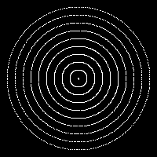

# Draw a circle
[](https://www.python.org/)
[](https://pypi.org/project/Pillow/)

[](https://github.com/Marfullsen/)

## Desc
Just drawing a simple circle with Python using [PIL](https://pypi.org/project/Pillow/) library, the docs are [here](https://pillow.readthedocs.io/en/stable/).
Also provides function to draw multiple circles.

## Install
1. Install `git`.
2. Clone, enter the directory.
``` 
git clone https://github.com/Marfullsen/draw-a-circle.git
cd draw-a-circle
```
3. Install dependencies.
```
pip install Pillow
```
or
```
python3 -m pip install Pillow
```
or´
```
sudo apt-get install python-pil
```
or
```
sudo pip install pillow
```
or
```
sudo easy_install pillow
```


4. Open with Python3
```
python draw_a_circle.py
```
5. Enjoy!

## Examples

[](https://github.com/Marfullsen/)


[](https://github.com/Marfullsen/)


## Credit
I just transcoded [this](https://stackoverflow.com/a/58629898) answer on StackOverflow written with Java.